[toc]


## chapter 5:栈

### 栈的增长方向

1. 在x86体系结构中，栈是逆增长的，指的是 push xxx 这条指令，esp、rsp 的值会减小对应的值，而arm 体系结构中，栈可以是递增也可以是递减的
2. 栈的逆增长和历史有关，程序中同时存在堆和栈，两者都可以增长，那么具体增长到多少是无法提前确定的，所以将栈设计为逆增长，类似于一个笔记本记录两门课的笔记，一门从前往后去记，一门从后往前记

### 栈的用途

1. 保存函数的返回地址
2. 参数传递
   1. 具体参数的地址要根据函数的调用约定来确定
3. 存储局部变量
4. alloca函数直接使用栈来分配内存
5. windows seh 结构化异常处理
6. 缓冲区溢出保护

### 典型的栈的内存存储格式

在32位中，在程序调用函数之后，执行它的第一条指令之前，栈在内存中的布局格式如下。

| ---------------------- |                                |
| ---------------------- | ------------------------------ |
| esp - c                | 第二个局部变量，ida中记为var_8 |
| esp - 8                | 第一个局部变量，ida中记为var_4 |
| esp - 4                | 保存的ebp 的值                 |
| esp                    | 返回地址                       |
| esp + 4                | arg1，ida中记为arg_0           |
| esp + 8                | arg2，ida中记为arg_4           |
| esp + c                | arg3，ida中记为arg_8           |

### 栈的对齐粒度

- 在32位程序中，编译器编译的代码一般对栈是8字节对齐，但在64位程序中，编译器编译出来的代码对栈一般是16字节对齐，一个函数调用另一个函数时，因为压入的8字节返回地址，使本来对齐16字节的栈不对齐了，所以一般在函数开头有使栈对齐16字节的指令

- [详细解释看这]: http://www.cpu2.net/stackalign.html

## chapter 6: 参数传递

### x86：传递3个参数

1. msvc 2010
   1. 使用push 来向栈中传递参数
2. gcc 4.4.1
   1. 先使用sub 来开辟栈空间，再使用mov 来直接操作栈中的数据

### x64：传递9个参数测试

1. msvc 2010  2019

   1. debug 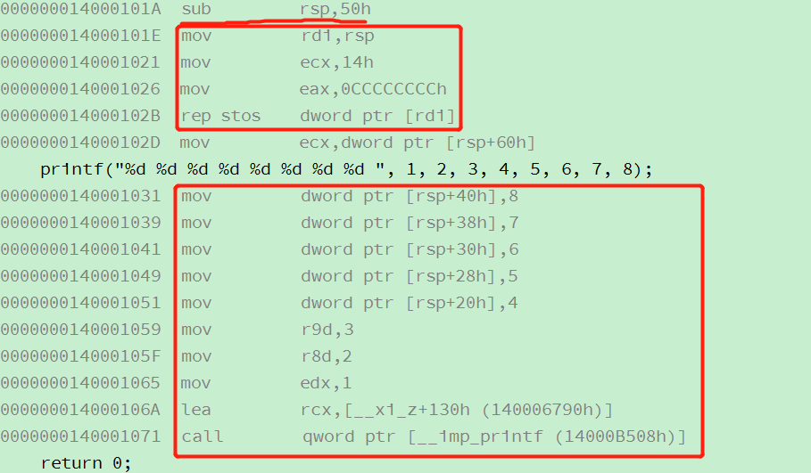

   2. release：这种情况编译器保证传参的位置是对的，不保证传参的顺序，同时使用lea代替mov，表明编译器认为lea执行的比mov更有效率

      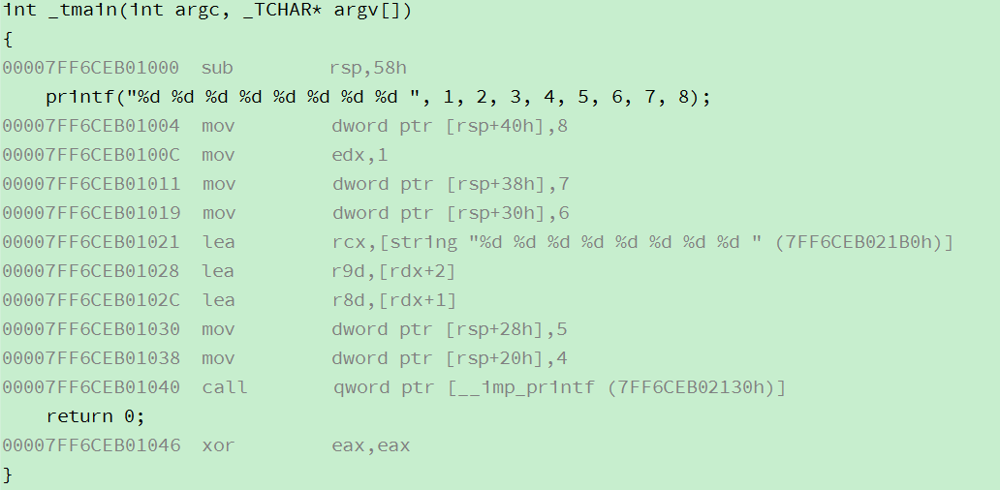

      - 在64位中，整形数据只占用4字节空间，但编译器还是为其分配了8字节，不仅是为了方便系统对参数进行寻址，而且编译器会进行地址对齐，所以64位系统为所有数据类型大小小于8字节的类型，都保存8字节空间，同理，32位系统为所有数据类型都保存4字节空间。

      - win64 程序传递参数使用cd89这四个寄存器，超过四个参数的使用栈来传参，并且传递顺序是从右向左依次传参

2. GCC 

   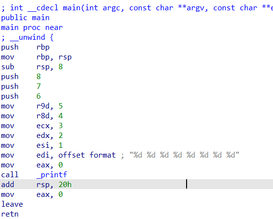

   *unix 64程序，优先使用 rdi，rsi，rdx，rcx，r8，r9，来传递前六个参数，然后利用栈来传递其余的参数。

## chapter 7：全局、局部变量的使用

### 案例一：局部变量x

##### x32

- 
- x是局部变量，使用lea 得到 x的地址，
- 开头的push ecx，在结尾找不到对应的pop ecx，所以并不是保存ecx寄存器的作用，而是开辟了一个4字节的栈空间

###### gcc

- 和msvc类似，只不过传参的时候使用mov 来传参

##### x64

###### msvc


###### gcc


### 案例二：全局变量x

- 在linux x86中使用 全局变量是，变量x如果有不为0的初始值，那么编译器会将x存放在data段中，如果初始值为0，编译器会将x放在bss段中

### 案例三：对scanf 执行流程的控制

###### x32

- 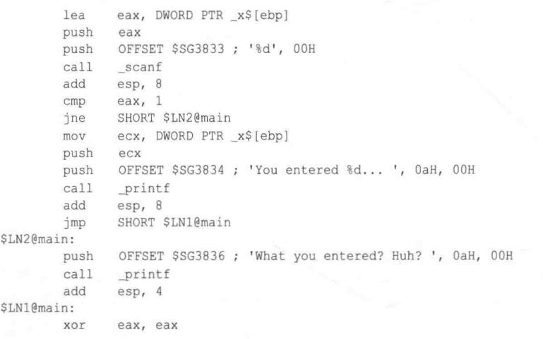
- 一般来说，条件判断语句会成对的出现 cmp/jcc 汇编指令，cmp会设置标志位，jcc会根据标志位来进行跳转

## chapter 8：参数获取

### x32

#### msvc

- 

#### gcc

- 
- 和msvc编译出来的程序大体一致，不过gcc没有使用 mov esp，ebp pop ebp来恢复栈帧，而是使用了leave 一条指令

### x64

#### msvc

- 开启优化

  - 

- 未开启优化
  - 
  - 原先位于寄存器中的三个参数先放入到了栈中，在从栈中取出数据进行运算，这个现象叫做 shadow space 
  - 在使用阴影空间时，由调用方函数分配栈空间，被调用函数使用栈空间

## chapter 9：返回值

在x86系统中，被调用方函数通常使用eax来返回运算结果，若返回值是char 或 byte 类型，返回值将存储在eax的低八位，al中，如果返回值是float 浮点数，那么返回值存储在 fpu 的 st(0)寄存器中。

#### void型函数的返回值

- 在linux 中，如果main函数的类型是void，此时eax的值是最后一个被调用的函数返回的垃圾数据
- 在windows 中，msvc 2010，如果main返回void，编译器会将返回值设置为0

#### 函数返回值不被调用的情况

- 返回的结果被抛弃

#### 返回值为结构体类型的数据

- 如果函数的返回值是大型结构的数据，那么由调用方负责分配空间，给结构体分配指针，再将指针作为第一个参数传递给函数。

## chpater 12：条件转移指令

### 数值比较


##### x32

- ###### msvc

  - f_signed

    

  - 第一个条件转移指令是 jle，小于等于时跳转，如果大于，则不跳

  - 第二个条件转移指令是 jnz，不等于时跳转，

  - 第三个条件转移指令是 jge，大于等于时跳转，

  - 这里检查的标志位是“sf xor of”（1 意味着异号） 和zf （1意味着相等）

  - f_unsigned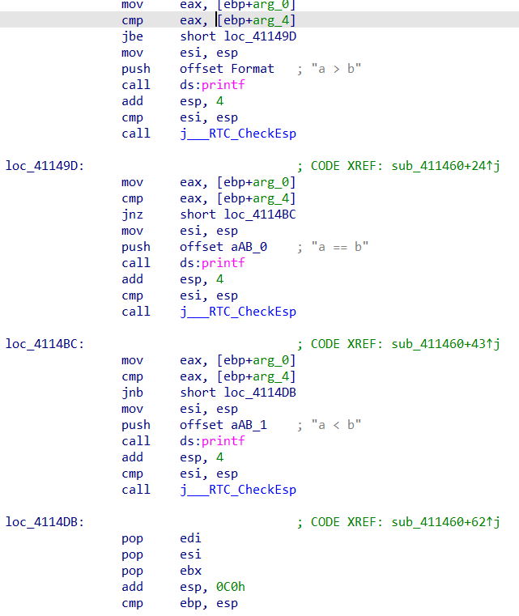

  - 和f_signed 函数大体相同，只不过条件转移指令使用的是 jbe和 jnb（有可能使用jae）

  - 这里跳转指令检查的是 cf （1意味着小于）和 zf（1意味着相等）

  ###### gcc 

  - gcc 在关闭优化的情况下，编译出来的程序与msvc编译出来的程序没什么区别

    但是，在开启优化的情况下，gcc编译出来的指令如下，并且使用jmp替代了 call puts retn这种指令，

    

### 计算绝对值

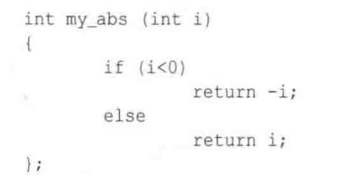

##### msvc x64

- debug
    
- release
    

- debug下，msvc编译的结果比较繁琐，realease进行了一定的优化

### 条件运算符


##### x32

- 早期无优化的编译器将条件运算编译成if/else，代码较复杂，


- 新编译器生成的代较简洁


##### x64

msvc


- 使用cmove指令，根据zf标志位决定是否将rdx赋值给rax

### 比较最大值和最小值

##### x32

- 不启用优化，使用条件转移指令，启用优化，使用cmovcc 指令


##### x64

- 和x32类似

### 总结

- 条件转移指令构造大体如下

```asm
cmp reg1, reg2/value
jcc true
false:
	some code to be excuted if comparsion is false
	jmp exit
true:
	some code to be excuted if comparsion is true
exit:
```

- 无分支指令

```asm
cmovcc
```

## chapter 13：switch/case/default

### 13.1 case 较少的情况

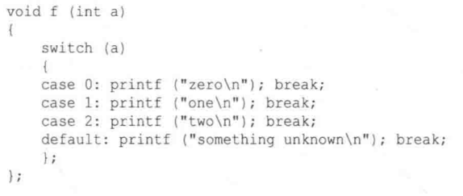

##### x32

- 无优化，msvc 2010


- 开启优化 msvc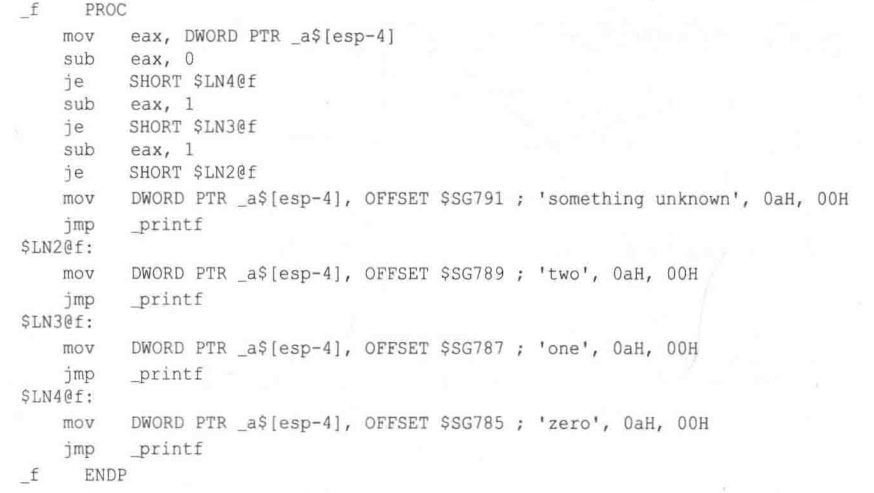
  - 将字符串直接赋值给变量后，直接jmp指令调用printf 函数，省略了一次call指令造成的函数返回开销

### 13.2 case 较多的情况


##### x32

- 无优化 msvc
  - 
  - case值连续较多的情况下，会生成一张jmp表，用case的值作为索引
- 无优化 gcc
  - 
  - 和 msvc 类似，都使用了jmp 表
- 总结
  - switch中case较多的情况，通常会采取jmp表
  - 

### 13.3 case 多对一的情况


##### msvc

- 
- 
- 程序中用到两张表，一张索引表，一张转移表
- 程序先根据输入值从索引表中取出索引，再根据索引去转移表中寻找转移的地址

## chapter 14：循环

### 14.1 for循环


- msvc 2010 未开启优化
  - 
  - 
- msvc 2010 开启优化
  - 
  - 开启优化后，编译器将局部变量i优化成使用寄存器esi，在局部变量为数不多的情况下，编译器通常会进行这种优化。
- 总结：
  - 循环编译出来的代码一般开始会有一个条件判断，判断循环的条件是否成立，成立之后再执行循环体，循环体执行完后，会跳转到（可能有）对循环变量更改的地方，更改完后会再次判断循环条件是否成立。
  - 如果编译器能够检测循环语句的初始状态不可能满足循环体的执行条件，那么编译器可能根本不会为循环条件和循环体生成对应的指令

### 14.2 内存块复制


- gcc x64
  - 
  - 

### 14.3 总结

- 一般的循环指令格式如下。

```asm
	mov [counter], 2
	jmp check
body:
	;loop body
	;do something here
	;user counter value in local stack
	add [counter], 1
check:
	cmp [counter], 9
	jle body
```

- 如果没有开启优化选项，那么控制变量递增的语句(add [counter], 1)可能递增为三条指令。

```asm
	mov [counter], 2
	jmp check
body:
	;loop body
	;do something here
	; use counter in ebx
	mov reg, [counter]
	inc reg
	mov [couner], reg
check:
	cmp [counter], 9
	jle body
```

- 当循环体比较短小，或局部变量较少时，编译器可能会给循环条件分配专用的寄存器

```asm
	mov ebx, 2
	jmp check
body:
	;loop body
	;do something here
	inc ebx
check:
	cmp ebx, 9
	jle body

```

- 编译器还可能调换部分指令的顺序

```asm
	mov [counter], 2
	jmp label_check
label_increment:
	add [counter], 1
lable_check:
	cmp [counter], 10
	jge exit
	;loop body
	;do something here
	jmp label_increment
exit:
```

- 通常情况下，程序执行应当首先判断执行条件是否满足，然后再执行循环体，但当编译器能确定第一次迭代肯定会发生的 情况下，它可能会调换循环体语句和判断语句的位置。

```asm
	mov reg, 2
body:
	;loop body
	;do something here
	inc reg
	cmp reg
	jl body
```

- 为什么现在编译器都不使用loop语句了？

循环体语句过于复杂，而loop只会检测ecx寄存器的值是否为0，不为0则递减然后跳转到循环体

## chapter 15：strlen

### strlen

- 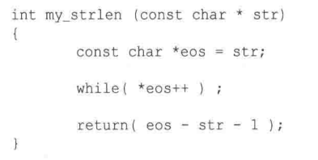

##### x32

  - 无优化 msvc
      - 
- 无优化 gcc
  - 
  - setnz al，当zf 为0时，设置al为1
- 开启优化 msvc
  - 
- 开启优化 gcc
  - 

##### 练习题

- 

  - ```c
    int count_32(const char * str)
    {
        int count = 0;
        if(*str){
            while(*str){
                if (*str++ == 32)
                	count++;
            }
        }
        return count;
    }
    ```

- 

  - 和上面功能一样

## chapter 16：数学计算指令的替换

### 16.1 乘法

- 替换为加法运算

  - 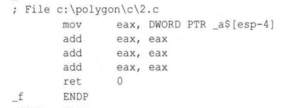

- 替换为位移运算

  - 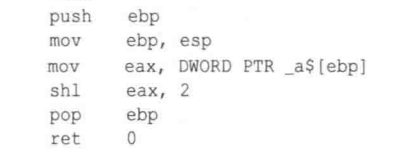

- 替换为位移、加法的混合运算

  - x32

    - 

    - ```asm
      ; return a * 7
      ; ecx = a
      mov ecx, dword ptr ds:[esp+4]
      ; eax = ecx * 8
      lea eax, dword ptr [ecx*8]
      ; eax = eax - ecx = ecx * 8 - ecx = ecx * 7
      sub eax, ecx
      ```

    - ```asm
      ; return a * 28
      mov ecx, dword ptr ds:[esp + 4]
      lea eax, dword ptr [ecx * 8]
      sub eax, ecx
      shl eax, 2
      ```

    - ```asm
      ; return a * 17
      mov eax, dword ptr ds:[esp + 4]
      shl eax, 4
      add eax, dword ptr ds:[esp + 4]
      ret
      ```

### 16.2 除法运算

- 替换为位移运算

  - ```asm
    ; return unsinged int a / 4
    mov eax, dword ptr ds:[esp + 4]
    shr eax, 2
    ret
    ```

### 16.3 练习题

- 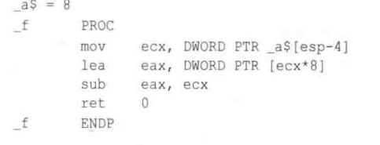
  - 返回 参数 * 7

## chapter 17：FPU

### 17.1 浮点数 intel 存储方式

在x86上，80486处理器问世之前，fpu叫做协、辅助处理器，80486之后，cpu集成了fpu的功能。

在80486之前，提供的fwait指令，和opcode以d8-df开头的指令，fwait的作用是让cpu等待fpu运算完毕。

fpu自带一个8个80位寄存器构成的循环栈。这些80位寄存器以ieee 754 格式存储浮点数数据，通常叫做ST(0)-ST(7)寄存器。

ida和od都把 st(0) 显示为st。不少书籍也将 st(0) 叫做栈顶寄存器

### 17.2 浮点数运算

- 
- x32 msvc
  - 
  - 指令1执行后：st0寄存器是参数一
    - fld从栈中读取八个字节，并将这个值转换为fpu寄存器的80位格式
  - 指令2执行后：st0寄存器是参数一除以3.14的结果
    - fdiv指令将st0寄存器的值作为被除数，运算之后，st0将保存商
    - fdivp指令在运算时，先将st1 st0的值pop之后，运算之后，将结果再push，此时st0将保存商
  - 指令3执行后：st0寄存器是参数二，st1是参数一除以3.14的结果
  - 指令4执行后：st0寄存器是参数二乘以4.1的结果
    - fmul指令将st0寄存器中的值乘以后面的参数，并将结果保存到st0寄存器中
  - 指令5执行后：st0寄存器就是计算的结果
    - faddp st1，st0 指令计算栈顶两个值的和，先把运算结果存储在st1寄存器，再pop st1。所以运算表达式的结果存储在栈顶的st0寄存器里。
  - 如果一个函数的返回值是一个浮点数，那么返回值约定放在寄存器st0中
- x32 gcc
  - 
  - 
  - fld 将3.14 加载到寄存器 st0 中
  - fdivr 是reverse divide 的缩写，操作数和fdiv 相反，所以此时将 ebp+arg0 作为被除数，将 st0 作为除数
  - faddp 将st1 和 st0的值pop出来，计算出的结果再放回st0中

### 17.3 传递浮点参数

- 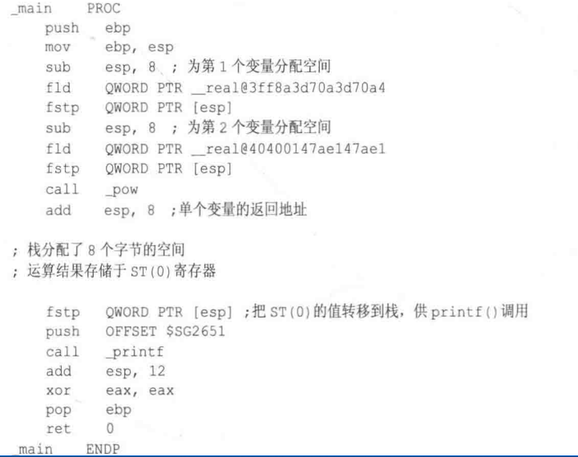
- 开辟了两个全局变量来存储参数，传参时先将值加载到寄存器中，然后再写入栈中。（因为汇编指令的操作数不能是立即数？maybe。。。）


